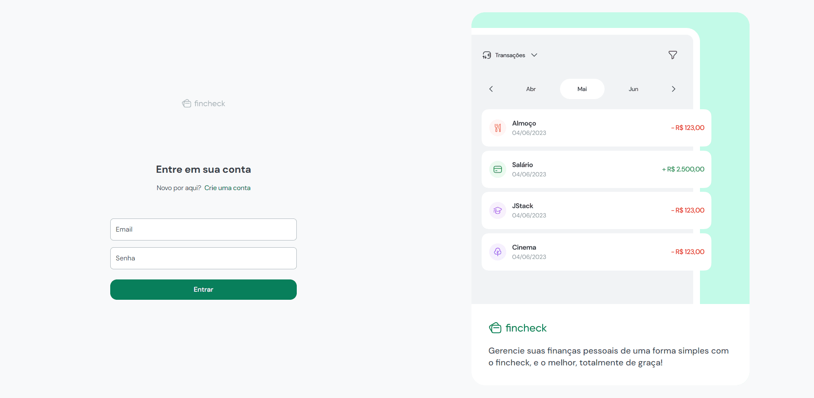
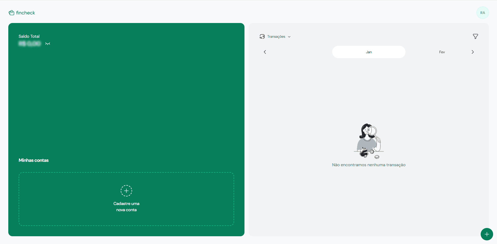
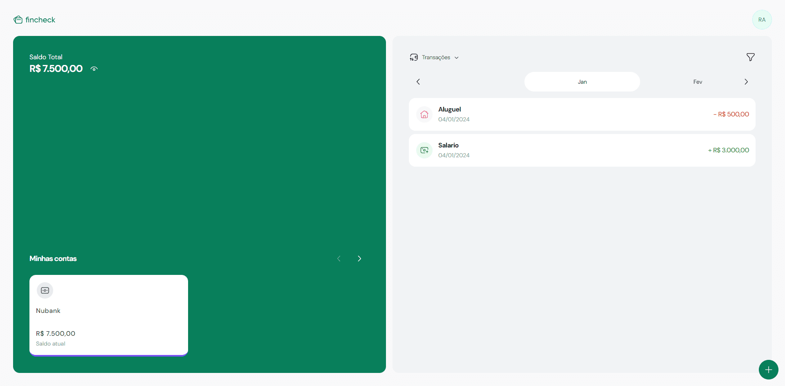
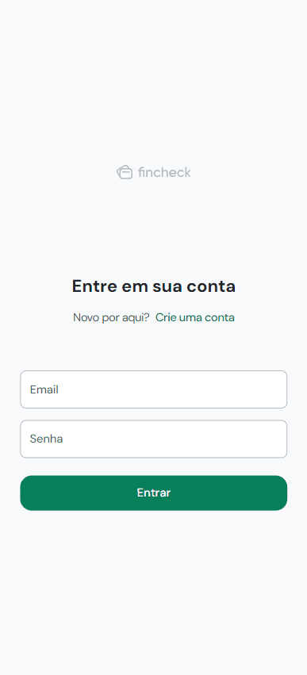

## Fincheck - fe

## Descrição

O Fincheck - fe é uma aplicação front-end desenvolvida como parte do curso JStack. Essa aplicação tem como objetivo facilitar a gestão financeira dos usuários, integrando-se à API Fincheck. Com o Fincheck - fe, cada usuário pode aprimorar o controle sobre suas finanças, permitindo o cadastro de gastos, despesas e receitas.

## Recursos Principais

Cadastro de gastos, despesas e receitas.

Filtragem e visualização detalhada das transações.

Capacidade de gerenciar múltiplas contas bancárias.

## Conta de Usuário Personalizada

Cada usuário possui uma conta exclusiva.
Faça login ou registre uma nova conta para começar a utilizar a aplicação.

## Layout Web

## Layout Mobile

## 🛠️ Tecnologias

💻 **Front-end**

-   [React](https://react.dev/): O uso de React foi devido à sua ampla popularidade, flexibilidade notável, capacidade de reutilização de componentes e aproveitamento eficaz de hooks. Essas características convergem para uma eficiência notável na construção de interfaces de usuário interativas.
-   [Typescript](https://www.typescriptlang.org): TypeScript para tipagem do código, proporcionando não apenas uma manutenção mais simplificada, mas também prevenindo potenciais erros e elevando a legibilidade do código.
-   [Vite](https://vitejs.dev/): Usei esse bundler pelos beneficios devido à sua rapidez no desenvolvimento e build, proporcionando uma experiência de desenvolvimento mais eficiente.

📚 **Bibliotecas**

-   [react-router-dom](https://reactrouter.com/en/main): Utilizado para gerenciar as rotas na aplicação React. escolhi essa lib por causa da facilidade de integração com componentes React. Podendo criar uma navegação de página única de forma eficiente, proporcionando uma experiência de usuário suave e dinâmica.

-   [@headlessui/react](https://headlessui.dev/react/): usei essa lib por ser muito util na criação de componentes sem estilos, facilitando a personalização das interfaces do usuário.

-   [@radix-ui](https://radix-ui.com): Usei o Radix em duas partes da aplicação. Usei seus ícones, que por ser da mesma biblioteca todos se manteram no mesmo padrão visual. Além disso, usei por conta de conseguir usar "componentes sem estilização" que podem ser utilizados facilmente pela aplicação.

-   [@tanstack/react-query](https://react-query.tanstack.com/): Uma biblioteca para gerenciamento de estado e cache em aplicações React, facilitando a busca e atualização de dados.

-   [axios](https://axios-http.com/): Usei o axios que é uma biblioteca para fazer requisições HTTP no navegador e no Node.js. Utilizei ela para consumir minha Api.

-   [clsx](https://github.com/lukeed/clsx):Utilizei o clsx porque é uma otima escolha junto com o Tailwind. Possibilitando adicionar condições em JavaScript diretamente nas classes, facilitando e muito a estilização do projeto.

-   [date-fns](https://date-fns.org/): Uma biblioteca moderna para manipulação de datas em JavaScript.

-   [react-day-picker](https://react-day-picker.js.org/): Um componente React para escolher datas de forma fácil e flexível.

-   [react-hook-form](https://react-hook-form.com/): Utilizei o react hook form para melhor gerenciamento e criação de formularios.

-   [react-hot-toast](https://react-hot-toast.com/): Uma biblioteca para notificações toasts elegantes em React.

-   [react-number-format](https://github.com/s-yadav/react-number-format): Um componente React para formatar e exibir números de entrada.

-   [react-router-dom](https://reactrouter.com/en/main): Utilizado para gerenciar as rotas na aplicação React.

-   [swiper](https://swiperjs.com/): Uma biblioteca moderna para criar sliders e carrosséis interativos.

-   [tailwind-merge](https://github.com/benface/tailwind-merge):Fiz uso combinado com o clsx, utilizado para juntar classes de Tailwind.

-   [zod](https://github.com/colinhacks/zod): O zod é uma biblioteca de validação de schemas, assim garantindo a manipulação de dados.

🎨 **Estilização**

-   [tailwindcss](https://tailwindcss.com/docs/installation): Utilizei tailwind por conta de facilidade em estilizar podendo utilizar estilização inline, alem de claro poder customizar novos estilos.

🔋 **Versionamento e Deploy**

-   [Git](https://git-scm.com) Utilizei Git para controle de versionamento, o que facilita o trabalho colaborativo e o acompanhamento das alterações no código.

-   [Vercel](https://vercel.com/) A escolha da Vercel para deploy foi feita devido à sua integração fácil com repositórios Git e sua eficiência no deployment de aplicações front-end.

⚙️ **Configuranções e Instalações**

Clone do Projeto

    $ git clone https://github.com/Faelkk/my-portfolio

Instalando as dependências

    $ npm install

Iniciando o projeto

    $ npm run dev

 

**Como me ajudar nesse projeto?**

-   Você ira me ajudar muito me seguindo aqui no GitHub
-   Dando uma estrela no projeto
-   Conectando-se comigo no LinkedIn para fazer parte da minha rede.

 

**Feito por**
[Rafael Achtenberg](linkedin.com/in/rafael-achtenberg-7a4b12284/)
